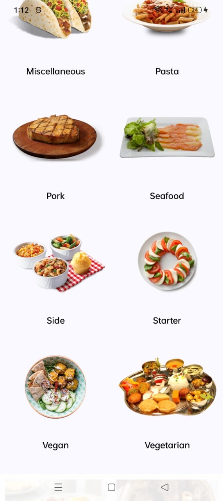

# 🍽️ NutriSnap – A Data-Driven Healthy Recipe Explorer

Welcome to **NutriSnap**, a smart food discovery app built using **TheMealDB API**. It helps users explore healthy and delicious meals based on categories, cuisines, and ingredients — all through a clean, user-friendly interface.

---

## 🌟 Features

- 🔍 **Search Recipes by Name or Ingredient**
- 🥘 **Browse Recipes by Category or Cuisine**
- 📸 **View Full Recipe Details with Images**
- 🧑‍🍳 **Step-by-Step Preparation Instructions**
- 📥 **Save Favorites (Optional Feature)**
- 📊 *(Coming Soon)*: Nutrition Insights and Smart Recommendations

---

## 🎯 Project Vision

NutriSnap was created as part of a data/ML-driven event to show how **open food datasets** can power intelligent and useful apps. With TheMealDB API, we deliver a seamless food discovery experience. Future updates will integrate **ML-based meal suggestions** and **goal-based filtering**.

---

## 🧠 Future Enhancements

- 🍎 Add nutrition-level filters (e.g., low-carb, high-protein)
- 🤖 Smart recipe recommendations (based on user behavior)
- 📅 Goal-based meal planning with calendar
- 🎙️ Voice-based recipe search (using ML speech models)

---

## 📸 Screenshots

|## 📸 Screenshots

| Home Screen 1 | 
|---------------|
|  |

| Home Screen 2                   |
|---------------------------------|
|  |
---

## 🛠️ Tech Stack

- **Frontend:** Android (Kotlin, Jetpack Compose)
- **API:** [TheMealDB](https://www.themealdb.com/)
- **Architecture:** MVVM (Model-View-ViewModel)
- **Libraries:** Retrofit, Coil, LazyVerticalGrid

---

## 🧑‍💻 Author

Built with ❤️ by **Prajwal L K Urs**  
📧 prajwallkursu@gmail.com  
🔗 [GitHub: @iprajwallkurs](https://github.com/iprajwallkurs)

---

## 📂 How to Run

1. Clone the repository
2. Open in Android Studio
3. Connect your device or emulator
4. Build and run the project

```bash
git clone https://github.com/iprajwallkurs/nutrisnap.git
